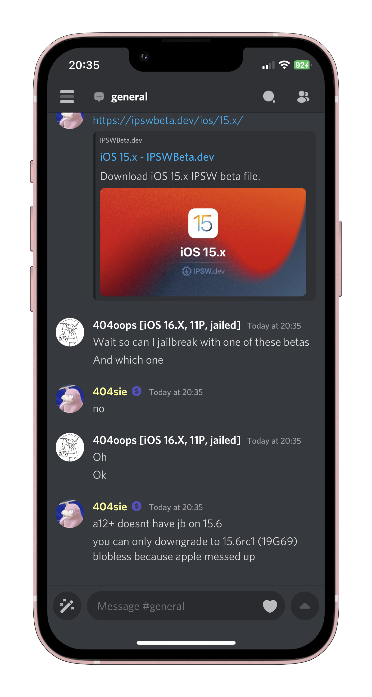

# Rosiecord

## A custom Enmity patcher with interchangeable fonts, icons, and tweaks :3

### How to install

The [Releases](https://github.com/acquitelol/rosiecord/releases/) tab has all of the IPAs that you can install. Sideload the IPA normally, as if you were sideloading Enmity.

**Please note that Rosiecord does not work with Altstore, and must be used with Sideloadly.**

Here is what the 2 different releases for each Discord Version mean:

- Rosiecord_[VERSION] (K2Genmity)
  - Contains a custom [Enmity](https://github.com/enmity-mod) tweak by [Mafu](https://github.com/m4fn3) called [K2Gemity](https://github.com/m4fn3/K2genmity) which allows for biometric authentication with the use of the [K2geLocker](https://github.com/m4fn3/K2geLocker) plugin.

- Rosiecord_[VERSION]
  - Contains a regular [Enmity](https://github.com/enmity-mod) tweak, downloaded from [here](https://github.com/enmity-mod/tweak) and injected into every IPA.

### The IPAs may seem confusing and cluttered

People wanted variations for each IPA, so here is what each IPA means and how the naming convention works:

Rosiecord_[[FontName]](https://github.com/acquitelol/rosiecord/tree/master/Fonts/woff2)-Font+[[IconPack]](https://github.com/acquitelol/rosiecord/tree/master/Packs)_Pack([[+Flowercord]](https://github.com/acquitelol/rosiecord/tree/master/Flowercord_Patcher)).ipa

             ^^^ Font used    ^^^ Icon pack used

## You can look at the IPA names in [Releases](https://github.com/acquitelol/rosiecord/releases/), and choose the best one to fit your needs

### What is [Flowercord](https://github.com/acquitelol/rosiecord/tree/master/Flowercord_Patcher)?

#### [Flowercord](https://github.com/acquitelol/rosiecord/tree/master/Flowercord_Patcher) is an optional tweak injected into the Rosiecord IPA

#### It adds chat bubbles to messages and makes profile pictures in the chat area square. The following is a screenshot showing this

### Icon Pack Screenshots

#### This section highlights what each [icon pack](https://github.com/acquitelol/rosiecord/tree/master/Packs/) looks like with and without [Flowercord](https://github.com/acquitelol/rosiecord/tree/master/Flowercord_Patcher)

#### Of course, these screenshots will vary depending on the font and theme you use. The screenshots are simply meant to show what the [icon packs](https://github.com/acquitelol/rosiecord/tree/master/Packs/) look like

## Default - [Install](https://github.com/acquitelol/rosiecord/releases/latest)

(The default normie look)

  
  

## [Plumpy](https://github.com/acquitelol/rosiecord/tree/master/Packs/Plumpy) - [Install](https://github.com/acquitelol/rosiecord/releases/latest)

(Probably the most liked pack, constantly updated with new icons by another Rosie :3)

  
  

## [Iconsax](https://github.com/acquitelol/rosiecord/tree/master/Packs/Iconsax) - [Install](https://github.com/acquitelol/rosiecord/releases/latest)

(Uses some icons from Plumpy, given by Flower :3, includes quite modern icons.)

  
  

Created with <3 By **Rosie** in TypeScript :3

This project simply wraps the [Enmity](https://github.com/enmity-mod/enmity) Project with a new patcher and extra features ~ Show them some love!
