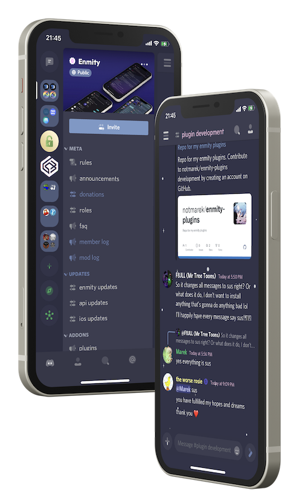

### Enmity, but with custom icons

 

> This repository is automatically keeping the releases up to date with [enmity-mod/tweak](https://github.com/enmity-mod/tweak)

 

# Plumpycord

*Theme [Rosie Blue](https://canary.discord.com/channels/950850315601711176/961782176062509117/1003810994084139078) by rosie#0110*

### Credits
Icons by: [Icons8](https://icons8.com/icons/plumpy) 
Modified for Enmity: flower#1116

